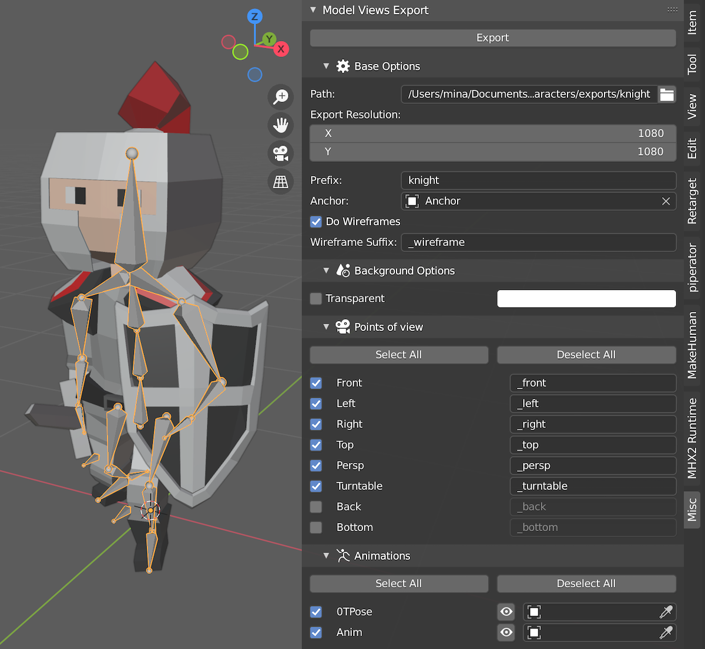
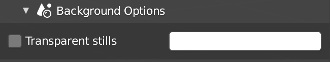
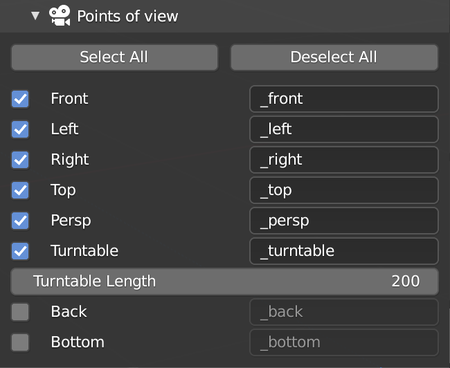
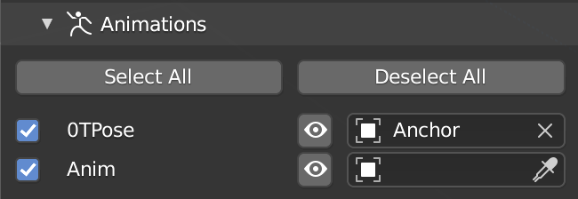
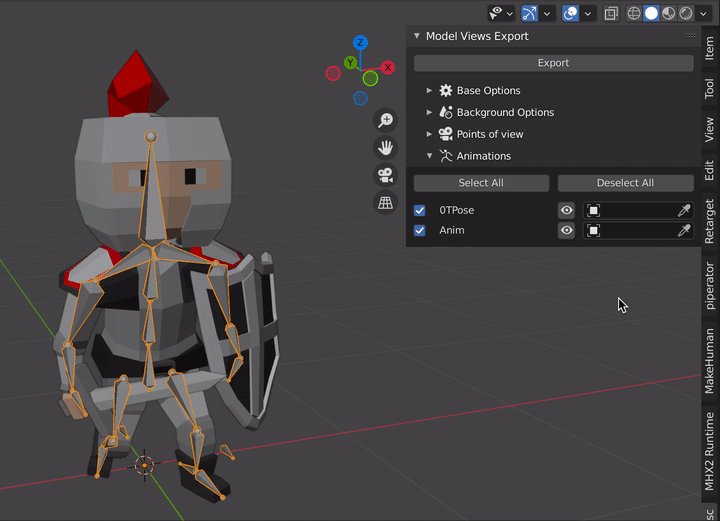

# Model Views Exporter (MVE)

Prepare and export screenshots or anim clips for your 3D models easily, using common points of view (front, side, top...) but also extra features like an auto-turntable or wireframed pictures!

The plugin works both for static and animated models.

- For static models (i.e. simple 3D meshes), it will create a series of still images from various common points of view (see below for more info).
- For animated models (i.e. rigged with an Armature), it will create the still images plus, optionally, movies for each selected animation applied on the given skeleton.

> If you have trouble using the plugin, or if you have any question, feel free to send me an email at: mina.pecheux@gmail.com :)

## Overview of the UI

Once installed, the MVE plugin panel can be found in the Properties panel, in the "Misc" tab.

It contains 3 or 4 subpanels: the Base Options, the Background Options, the Points of View and, optionally, the Animations. Note that the Animations subpanel will only appear if you selected an Armature.

> Because it is quite large, and to avoid overcrowding your UI, **the MVE panel will only show up if you have an object selected**.

## Options

### Base Options

- **Path**: that's the only required option - the export path for your pictures and clips. You won't be able to click the "Export" button if it's empty. You can specify this path by hand, or by clicking the folder icon on the right of the input and picking a directory on your computer.
- **Anchor**: by default, the MVE plugin will create the various cameras to look at the origin point, plus an offset that is half the size of the selected object. That might not be the best tracking point, so you can pass your own object as anchor if need be. The cameras will then take the position of this anchor as reference.
- **Export Resolution**: the size for all the exports (pictures and movies). It can be square or not. [default: `(1920, 1080)`]
- **Prefix**: a specific prefix to add to all your exports - this can help organize your files if you want to store galleries for several models in the same location! [default: `<empty>`]
- **Do Wireframes**: by default, the MVE plugin makes pictures and movies with the wireframe turned off, in Solid (but Textured) mode. If you enable this option, then the plugin will create a second export each time with the wireframe turned on for every mesh in your scene. [default: `True`]
- **Wireframe Suffix** *(only available if "Do Wireframes" is enabled)*: suffix to add to all the secondary exports with wireframe toggled on [default: `_wireframe`]

### Background Options

Making relevant shots means, among other things, finding a nice background color to get a proper contrast of your model.

The Background Options subpanel lets you pick this color easily:

You can also choose to export **transparent images**, but this **only works for the still screenshots** - animations (and turntables) will require an opaque background.

*Note: by the way, you can also use this utility to select a color-keying background color... :)*

### Points Of View (POV)

The MVE plugin relies on a system of points of view to know where to create the various cameras. For now, those POVs are hardcoded and you can only pick from the list.

This list contains the classic 3D POVs (more info on the ones with a star below):

- front
- left
- right
- top
- persp*
- turntable*
- (back)
- (bottom)

> Back and bottom views being usually less relevant, they are disabled by default (but you can of course toggled them back on if you want shots from those POVs).

<u>Suffixes</u>

Each active POV can be assigned a specific suffix. This suffix will be added to all exports that use this POV (pictures and movies, wireframes or not).

<u>Special POVs ("persp" and "turntable")</u>

The "persp" and "turnable" POVs are a bit special.

Here, I call "persp" a camera location slightly up and on the side but it still uses an orthographic camera type.

The "turntable" POV is a small utility to directly export a range of frames of the camera rotating around the model. The length of your turntables (160 by default) can be configured using the **Turntable Length** option that will appear if you turn on the "turntable" POV in the list.

<u>Quick selection</u>

You can use the "Select All" and "Deselect All" buttons above the list to quickly update the list of enabled POVs.

### Animations

*__Important note:__ this subpanel will only appear if you have selected an Armature in your scene.*

The Animations subpanel lists all the animations currently in the scene and allows you to choose which one to showcase in your exports.

*Note: the list of available animations is computed when the scene is opened so, if you create a new animation and want it to appear in the panel, you'll need to save your scene and re-open it.*

<u>Animation preview</u>

If you want to see how this animation affects your model, you can quickly preview it by assigning it with the eye icon.

Clicking the icon will directly update the currently selected Armature to display the given action:

<u>Anchors</u>

Similarly to the main **Anchor** option, each animation can be associated a unique anchor object to offset the tracking point. This can be useful if one of your animations frames your character very differently from the others.

<u>Quick selection</u>

You can use the "Select All" and "Deselect All" buttons above the list to quickly update the list of enabled animations.
