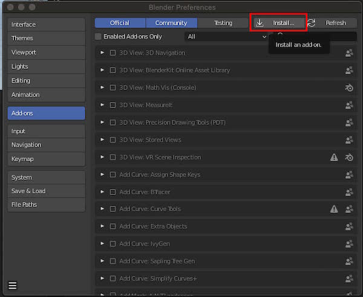
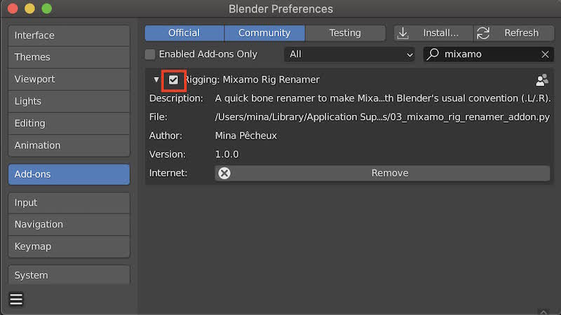

# Blender Plugins

A collection of various Blender plugins written using the Python API.

> If you have trouble using a plugin, or if you have any question, feel free to send me an email at: mina.pecheux@gmail.com :)

## How to use these Blender plugins?

To install any of these plugins to your Blender, simply download the Python file, then open your Preferences panel and go to the add-ons section.

Now, click on the "Install" button and pick the file on your computer.

Finally, don't forget to actually enable the plugin! :)

---

## List of available plugins

### [Rigging] Mixamo Rig Renamer

[🔍 Download the Python file](MixamoRigRenamer.py)

A little utility to easily rename all the bones in an armature downloaded from [Adobe's Mixamo](https://mixamo.com/) platform to the Blender's .L/.R convention.

By default, Mixamo's rigs have bones with non-Blender standardized names like "LeftArm", instead of "Arm.L". This can be particularly annoying for things like X-Axis mirror editing, because the tool cannot find the proper names and simply doesn't work!

> **How to use?** After installing **Mixamo Rig Renamer**, simply import the Mixamo armature in your scene, open the Properties panel and go to the "Misc" tab. There, you'll get a new panel called "Mixamo Rig Renamer". Click the "Rename" button and you're all set, with Blender standard bone names and all the animation data properly updated! :)

*Note: if necessary, you can change the prefix used by Mixamo in its FBX animation file in the **Mixamo Rig Renamer** panel. It should be the default `mixamorig` with the current Mixamo files but, if it ever changes in the future, make sure to update it!*