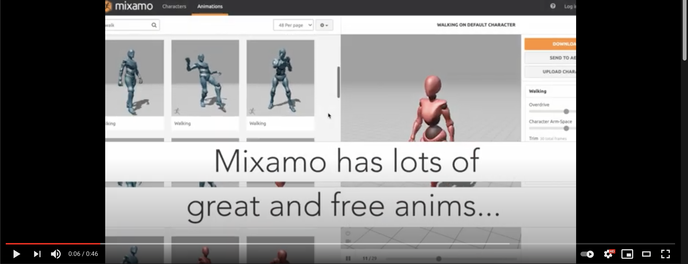

# Blender Plugins

A collection of various Blender plugins written using the Python API.

> If you have trouble using a plugin, or if you have any question, feel free to send me an email at: mina.pecheux@gmail.com :)

## How to use these Blender plugins?

To install any of these plugins to your Blender, simply download the Python file, then open your Preferences panel and go to the add-ons section.

Now, click on the "Install" button and pick the file on your computer.

Finally, don't forget to actually enable the plugin! :)

---

## List of available plugins

### [Rigging] Mixamo Rig Renamer

[🔍 Download the Python file](./Rigging/MixamoRigRenamer.py)

A little utility to easily rename all the bones in an armature downloaded from [Adobe's Mixamo](https://mixamo.com/) platform to the Blender's .L/.R convention. With version v2 (Jan. 2022), you can now also go back from the Blender-named
rig to a Mixamo-named one.

By default, Mixamo's rigs have bones with non-Blender standardized names like "LeftArm", instead of "Arm.L". This can be particularly annoying for things like X-Axis mirror editing, because the tool cannot find the proper names and simply doesn't work!

> **How to use?** After installing **Mixamo Rig Renamer**, simply import the Mixamo armature in your scene, open the Properties panel and go to the "Misc" tab. There, you'll get a new panel called "Mixamo Rig Renamer". Click the "Rename" button and you're all set, with Blender standard bone names and all the animation data properly updated! :)

*Note: if necessary, you can change the prefix used by Mixamo in its FBX animation file in the **Mixamo Rig Renamer** panel. It should be the default `mixamorig` with the current Mixamo files but, if it ever changes in the future, make sure to update it!*

### [Import-Export] Model Views Exporter

[🔍 Download the Python file](./ImportExport/ModelViewsExporter.py)

Prepare and export screenshots or anim clips for your 3D models easily, using common points of view (front, side, top...) but also extra features like an auto-turntable or wireframed pictures!

<!--  -->

Marketing your 3D assets can be a pain, because making a gallery of relevant camera views is long and repetitive! But they're essential to showcasing the model to your public - so how can we make this process more user-friendly?
The Model Views Exporter (MVE) plugin lets you automate your captures of static or animated models: just click on a few buttons and you'll directly get a nice gallery of shots!

> **How to use?** After installing **Model Views Exporter**, just open the Blender scene with the 3D model you want to showcase, open the Properties panel and go to the "Misc" tab. There, you'll get a new panel called "Model Views Export".  Choose an export path and configure the various options, or keep the default ones, then click on the "Export" button at the top: the process will start and after a little while you'll get all your screenshots and anim clips! :)

*Check out [the dedicated docs](./ImportExport/ModelViewsExporter.md) for more info on the available options.*
